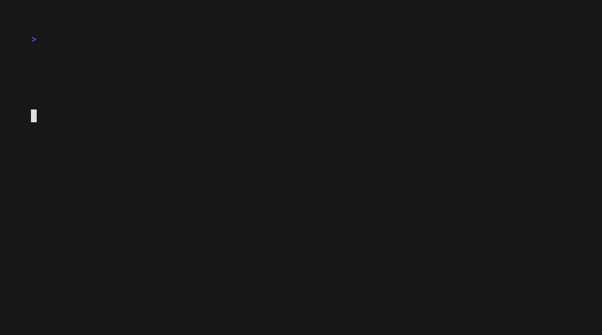

# rdor

Games in terminal

## Hanoi



Inspired by [Hanoi-Tower(iOS)](https://github.com/zrcoder/Hanoi-Tower)

## Sokoban

Inspired by [sokoban-go](https://github.com/rn2dy/sokoban-go)

## Maze

Leveles cloned from [mazefiles](https://github.com/micromouseonline/mazefiles)

## Install

```shell
go install github.com/zrcoder/rdor@latest
```

## Dependencies

[bubbletea](https://github.com/charmbracelet/bubbletea)

[bubbles](https://github.com/charmbracelet/bubbles)

[lipgloss](https://github.com/charmbracelet/lipgloss)

## License

MIT
