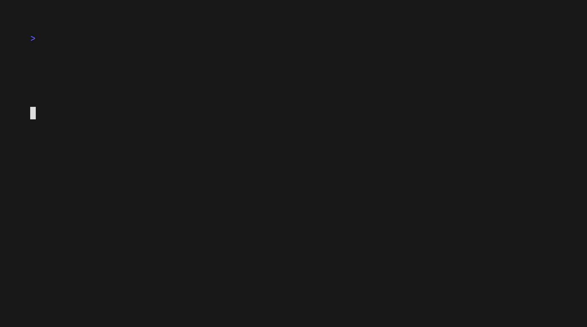
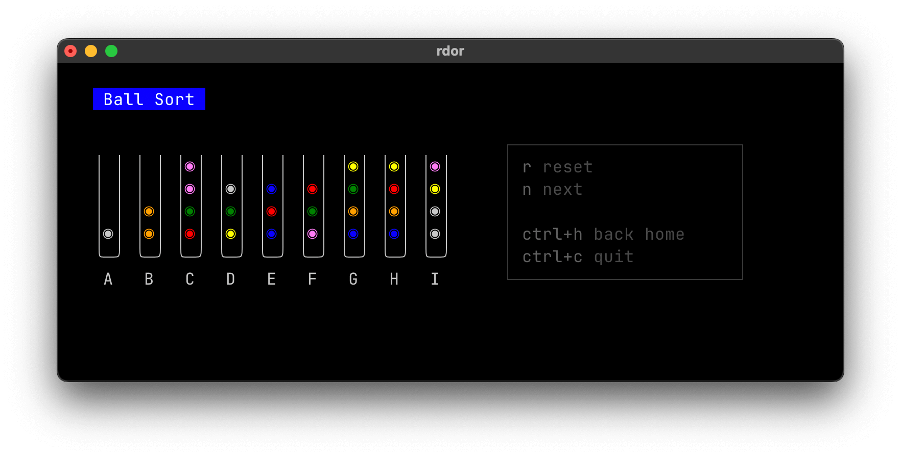

# rdor

Games in terminal

## Hanoi



Inspired by [Hanoi-Tower(iOS)](https://github.com/zrcoder/Hanoi-Tower)

## Sokoban

Inspired by [sokoban-go](https://github.com/rn2dy/sokoban-go)

## Maze

Leveles based on [mazefiles](https://github.com/micromouseonline/mazefiles)

## Last

Inspired by [lastone](https://github.com/zrcoder/lastone)

## N-Puzzle

## 24 points

## 成语填字

Leveles based on [vue-idiom-puzzle](https://github.com/huzongyao/vue-idiom-puzzle)

## Ball Sort



## Install

```shell
go install github.com/zrcoder/rdor@latest
```

## Dependencies

[bubbletea](https://charm.land/bubbletea/v2)

[bubbles](https://charm.land/bubbles/v2)

[lipgloss](https://charm.land/lipgloss/v2)

## License

MIT
